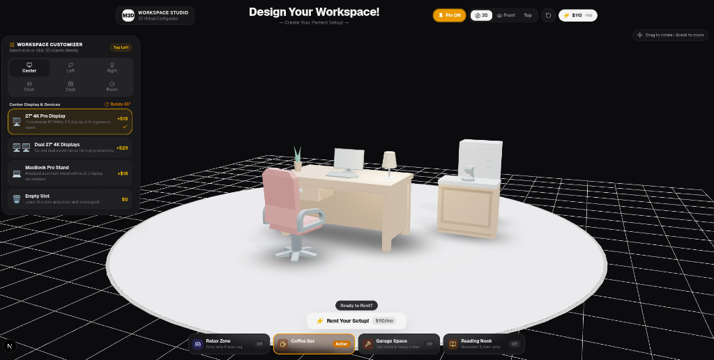

# Monis 3D Studio — Virtual Workspace Configurator

An interactive, real-time 3D workspace studio and rental estimation platform. Designed for professionals and teams to customize their dream office setup directly in a 3D spatial environment.



---

## 🚀 Getting Started

### Prerequisites
- Node.js 18.x or later
- npm, pnpm, or yarn

### Installation & Run

```bash
# Install dependencies
npm install

# Start development server with Turbopack
npm run dev
```

Open [http://localhost:3000](http://localhost:3000) in your browser.

---

## 💡 Short Write-Up

### 1. Approach
- **Direct 3D Spatial Interaction**: Rather than relying on traditional 2D forms or dropdown menus, the user customizes their workspace directly inside the 3D viewport. Every primary object (desk, chair, desk accessories, and room zones) features raycast hit detection, glowing pulse beacons, and contextual 3D pins.
- **Micro-Interactions & Usability**: 
  - Pins appear with a smooth ~180ms hover debounce and entrance animation to prevent jitter when sweeping the cursor across the scene.
  - Clicking an object locks its pin active, and clicking the pin opens a draggable, floating 3D popover so users can swap models and rotate elements without blocking their view.
- **Architectural & Ergonomic Room Layout**: 
  - The desk and ergonomic chair are placed in the front area of the circular studio platform, leaving the rear spacious for secondary room zones (such as a full Relax Lounge with sofa, ottoman, and round rug, a Coffee Station, a Garage Space, or a Reading Nook).
  - Built-in business rules prevent impossible configurations (e.g., maximum 2 displays total, single laptop limit).
- **Instant Rental Subscription Estimation**: Every component live-calculates into a transparent monthly rental subscription in USD ($), complete with a breakdown modal, one-click specs copy, and checkout celebration.

### 2. Tech Choices
- **Next.js (App Router)**: Fast, modern React framework with optimized asset delivery and production-grade stability.
- **Three.js & React Three Fiber (R3F)**: Declarative, component-driven 3D rendering pipeline enabling dynamic lighting, camera animations, and modular GLTF model loading.
- **@react-three/drei**: Provided world-space `<Html>` overlays seamlessly anchored to 3D coordinates, smooth `<OrbitControls>` view presets (3D Isometric, Front, Top-Down), and soft `<ContactShadows>`.
- **Zustand**: Centralized, predictable state store that synchronizes the 3D canvas and 2D UI panels with zero unnecessary re-renders.
- **Tailwind CSS & Lucide Icons**: Modern dark-mode glassmorphism, responsive drawer layout, and polished tactile UI feedback.
- **Canvas-Confetti**: Engaging visual celebration upon rental order confirmation.

### 3. What I'd Improve With More Time
- **Free-Form Drag & Snap**: Implement raycast surface dragging with collision bounds so users can place any accessory anywhere on the desk surface with snap-to-edge guidelines.
- **Material & Texture Customizer**: Add real-time material shader pickers for desktop finishes (solid walnut, white oak, matte black, frosted glass) and chair fabric swatches.
- **Post-Processing & Atmosphere**: Integrate R3F post-processing with SSAO (Screen Space Ambient Occlusion), Bloom for neon/lamps, and multiple lighting moods (Daylight, Sunset Studio, Cyberpunk Night).
- **WebXR / AR View**: Enable WebXR / QuickLook export (`.usdz` / `.gltf`) so users can project their customized workspace into their actual room via mobile camera.
- **PDF Quote & Team Sharing**: Generate a downloadable PDF quotation and unique shareable URL with encoded workspace state.

---

## 🛠️ Features Summary

- **Studio Desks**: Solid Oak (Drawers), Smart Standing Desk (Sit-Stand), Executive Corner L-Desk, Minimalist Frame.
- **Ergonomic Chairs**: Ergonomic Mesh Task Chair, Modern Fabric Cushion, Executive Lounge Chair.
- **Modular Desk Spots**: Single & Dual 4K Displays, MacBook Stand, Desk Lamps, Succulent, Foliage Plant, Hardcover Books, Hi-Fi Monitors.
- **Room Zones**: Relax Lounge (Sofa, Ottoman & Rug), Coffee Station Bar (Espresso machine & fridge), Garage Space (Shelves, crates & radio), Reading Nook (Bookshelf & standing lamp).
- **Camera Views**: 3D Isometric View, Front View, Top-Down Floorplan View.
- **Instant Rental Estimation**: Live pricing in USD with full breakdown drawer and copyable setup specs.
